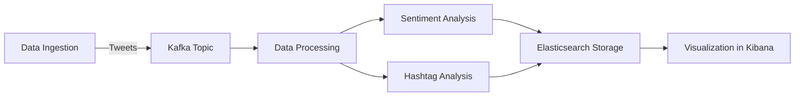

# Twitter-Stream-Processing-Pipeline

A scalable and real-time data pipeline for processing, analyzing, and visualizing Twitter data.


## Table of Contents

- [Overview](#Overview)
- [Features](#Features)
- [Installation](#Installation)
- [Technologies Used](#TechnologiesUsed)
- [Pipeline](#Pipeline)
- [Contributing](#Contributing)

## Overview

The Tweet Analysis Pipeline is designed to process live Twitter streams for sentiment analysis, trending hashtag identification, and data visualization.

- Problem: Extract meaningful insights from the vast amount of Twitter data in real time.
- Target Audience: Data scientists, social media analysts, and researchers.
- How It Works: Tweets are ingested using Kafka, analyzed with Scala ML models, and stored in Elasticsearch for visualization in Kibana.

## Features

- Simulation of real-time tweet ingestion using Kafka.
- Sentiment analysis with pre-trained ML models.
- Interactive dashboards in Kibana for data visualization.

## Installation

### Prerequisites

- Java 1.8.0_202
- Kafka 2-12-3.8.1
- Scala 2.12.17
- Spark 3.5.3
- Python 3.11.12
- Elasticsearch 8.16.1
- Kibana 8.16.1

### Steps

1. Clone the repository:

```bash
git clone https://github.com/amjadAwad95/Twitter-Stream-Processing-Pipeline.git
cd Twitter-Stream-Processing-Pipeline
```

2. Set up the Python environment:

In Elastic-Search-Index/src create file .env

```
elastic_name=YOUR_ELASTIC_NAME
password=YOUR_ELASTIC_PASSWORD
ca_certs=YOUR_ELASTIC_http_ca.crt
host=YOUR_ELASTIC_HOST_IP
```
```bash
pip install elasticsearch dotenv
```

3. Start Kafka

- In windows

```bash
cd C:\kafka_2.12-3.8.1\bin\windows
.\zookeeper-server-start.bat ..\..\config\zookeeper.properties
.\kafka-server-start.bat ..\..\config\server.properties
```

4. Start elastic search and kibana

- In windows

```bash
cd C:\elasticsearch\elasticsearch-8.16.1\bin
.\elasticsearch.bat
```

```bash
cd C:\elasticsearch\kibana-8.16.1\bin
.\kibana.bat
```

5. Run the pipeline:

To create an elastic search schema
```bash
cd Elastic-Search-Index\src
python main.py
```

To Start the Producer go to the scala folder named Kafka Producer and run the Main.scala
To Start the consumer go to the scala folder Kafka Consumer and run the Main.scala

To visualize data go to http://localhost:5601 then follow these steps:
On their local Kibana instance:
1. Go to the Management tab.
2. Navigate to Saved Objects.
3. Click the Import button.
4. Upload the .ndjson file you shared.

## TechnologiesUsed

- Stream Processing: Kafka
- Data Storage: Elasticsearch
- Visualization: Kibana
- Machine Learning: Stanford corenlp

## Pipeline



## Contributing

We welcome contributions! Follow these steps:

1. Fork this repository.
2. Create a new branch:
```bash
git checkout -b feature-name
```
3. Make your changes and commit them:
```bash
git commit -m "Your commit"
```
4. Push to the branch:
```bash
git push origin feature-name
```
5. Open a pull request.
